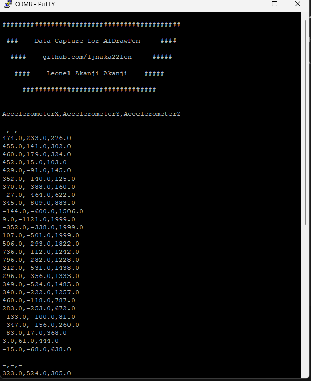
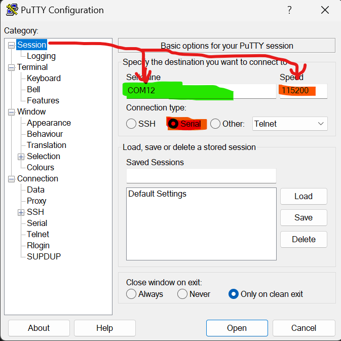
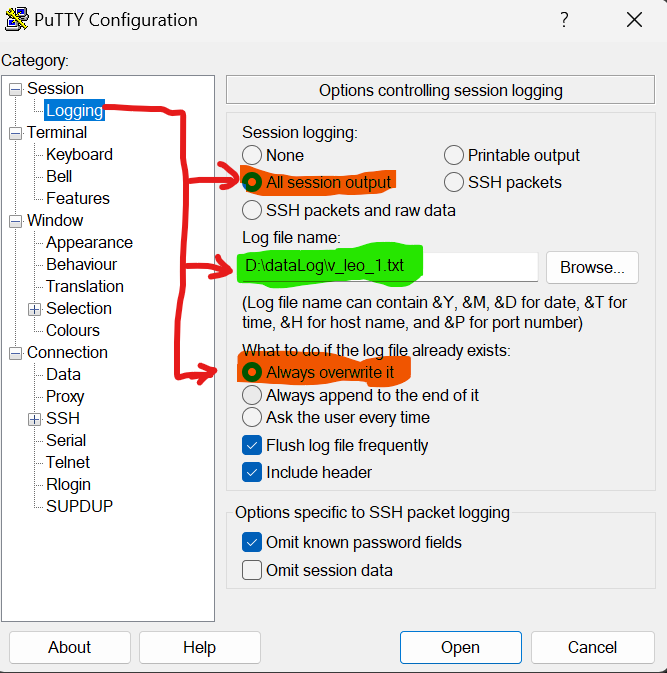
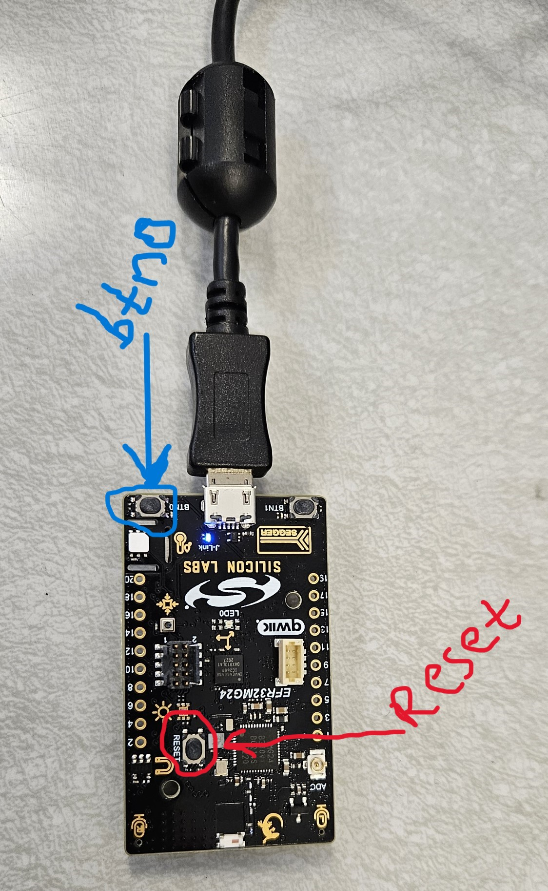

# Data Capture Manual for AIDrawPen projects taking reference from the magic wang projects.
As  Part of my [AIDrawPen](https://github.com/Ijnaka22len/AIDrawPen/) project, this project gives a faster way to collect data for projects taking reference from the [magic wang](https://github.com/tensorflow/tflite-micro/tree/3e190e5389be49c94475e509452bdae245bd4fa6/tensorflow/lite/micro/examples/magic_wand/train) projects on the Silicon Labs xG24 board.
<table>
  <tr>
    <td></td>
  </tr> 
</table>

## 1. Hardware Requirements
- [Silicon Labs xG24 board](https://www.digikey.com/short/9w8nhdc2)
- Long [micro usb cable](https://www.computercablestore.com/usb-20-cable-a-to-micro-mm-15-ft?gad_source=4&gclid=CjwKCAjwp4m0BhBAEiwAsdc4aEzUbsyIQ9IqPUrmsyAAr4gQH0s8XX1ysY9yvKXk7kmwy52SRoNG4RoC5TgQAvD_BwE)

## 2. Create Folder for Data Collection
- Create a folder named `dataLog/`.
- Download and upload the the [hexImuXYZDataCapure.hex
](ImuXYZDataCapure/hexImuXYZDataCapure.hex) file to the xG24 board.

## 3. File Naming and Configuration
- Use Putty for configuration.
- Save all files as text files with the `.txt` extension, e.g., `dataLog/v_leo_1.txt`.
- File naming format: `{shape}_{yourname}_{session}.txt`.
<table>
  <tr>
    <td></td>
    <td></td>               
  </tr> 
</table>

## 4. Using Putty Terminal
- Open the Putty terminal.
- Press the middle button (Reset) once.
- Hold the xG24 board horizontally and press the right-side button (btn0) to start recording data (drawing shapes).
- Release the button when done drawing the shape. Repeat for multiple shapes.
- Draw at least 60 shapes.
- Close the Putty terminal and repeat steps 2-3 for new sessions.
<table>
  <tr>
    <td></td>
  </tr> 
</table> 

